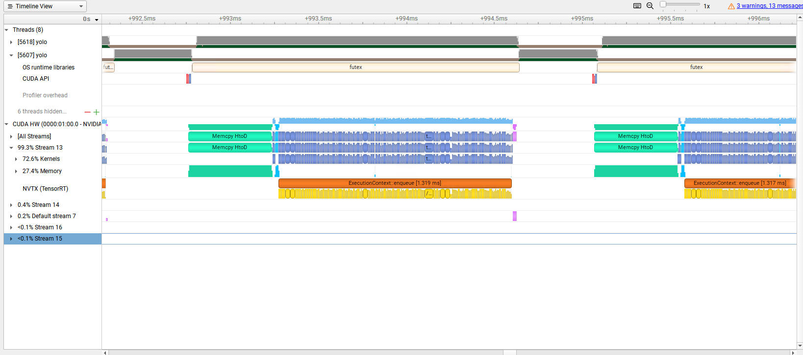
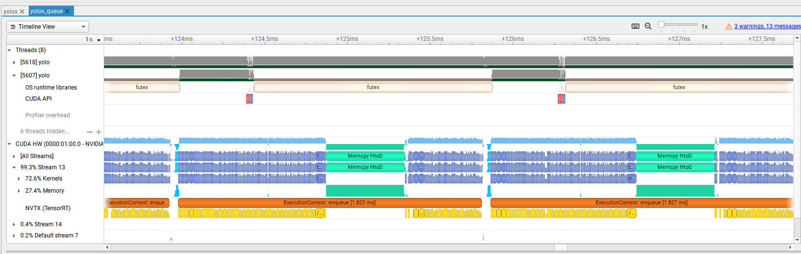
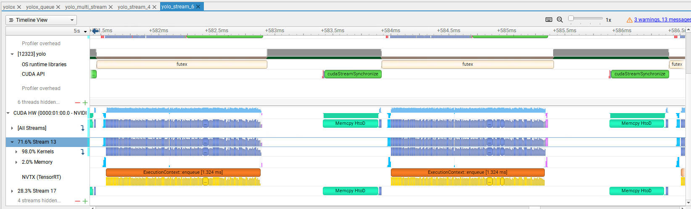
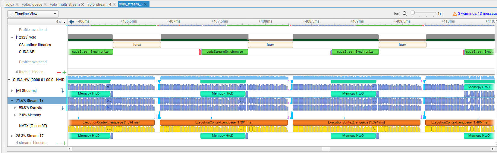
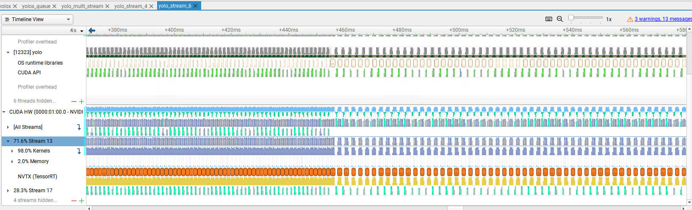

# Faster tensorrt

## 前言

使用之前你应该已经了解trt的构建和推理流程，所以此处不再涉及基础使用。你应该修改的最少有
```txt
1. CMakeLists.txt中的cuda、cudnn、trnsorrt环境路径
2. main.cpp中的测试推理图片/视频的路径、trt二进制文件路径，推理类别等
3. 预处理和后处理也要根据实际使用模型修改，本文代码以yolox为例
```

原始的TensorRT_Pro有十分优秀的性能，并且接口的设计也很巧妙。但是我在复现和使用的时候发现部分可能不太适用于我当前使用的机器人。
1. 它的加速是在将需要推理的所有图像全部commit, 然后它内部每个batch的加载和推理。但是在单目机器人上往往是视频流输入，此时是一般是不能输入batch数据的，所以此时实际上是不会比直接推理快多少。

2. 图像commit后的结果等待没有任务队列管理

3. 它用的是自写的CUDA NMS，但是实际上TensorRT8上有很多官方的NMS插件，可以替换。两者的实际效果对比待测试。


## 1. 文件说明

我在大多数地方都已经加了中文注释，应该能够容易看懂。当然注释可能也会有写错或者理解错误啥的，还是需要有自己的思考的，也欢迎一起交流。在`src`目录下一共有五大部分，分别是`apps`,`base`,`eval`,`kernel`,`main.cpp`。

### 1.1 base

这里主要是一些整体框架的基础，根据仔细需要求修改。

1. `tools.hpp`: 一些工具函数 包括log日志打印，CUDA检查，输出文件保存读取等定义并直接实现
2. `memory_tensor.hpp`: 定义`MixMemory`实现内存和显存的申请和释放；定义`Tensor`实现张量的管理、扩容、拷贝等
3. `memory_tensor.cpp`: `MixMemory`和`Tensor`的实现
4. `monopoly_accocator.hpp`: 定义内存独占管理分配器，最终实现预处理和推理并行的重要工具
5. `infer_base.hpp`: 定义trt引擎管理类和异步安全推理类
6. `infer_base.cpp`: trt引擎管理类和异步安全推理类的实现
7. `trt_base.hpp`: 定义trt引擎构建和量化
8. `trt_base.hpp`: trt引擎构建和量化实现

### 1.2 kernels

推荐把cuda相关实现放在此文件夹中。

1. `cuda_kernel.cuh`: cuda核函数的定义
1. `cuda_kernel.cu`: cuda核函数的实现，预处理和后处理相关的cuda加速代码


### 1.3 eval

这里一个评估相关代码，可以测试相关数据集(coco格式)使用trt推理的map，暂时主要针对目标检测。

1. `save.hpp`: 一个保存检测结果到文件里的类
2. `get_imgid_txt.py`: 读取`eval_results.json`，来保存图片name和id到文件`img_id.txt`
3. `eval.cpp`: 读取`img_id.txt`中的图片，进行推理，并保存相应结果到`results.txt`
4. `img_id.txt`: img的id和img的name的对应，便于评估
5. `results.txt`: 检测的结果
6. `eval_results.json`: 检测结果保存到json文件
7. `eval.py`: 最终的评估程序，打印结果


### 1.4 apps

这里是实际模型的实现地方，定义模型的结构，推理过程，预处理和后处理流程等，推荐每个模型新建一个文件夹实现。

1. `yolo/yolo.h`: 定义yolo的推理
2. `yolo/yolo.cpp`: yolo推理的实现


### 1.5 main

1. `main.cpp`: 主函数,调用和实现功能都在此处，动态的控制队列也是在此处实际推理中实现。


## 2. 使用教程

### 2.1 模型转换

#### 2.1.1 trtexec
模型转换部分，在不需要增加自定义算子的时候，想要导出tensorrt的engine，**trtexec is all you need！**

```shell
# 构建模型时
trtexec 
    --onnx = ./model NCHW.onnx  # 指定onnx模型文件名
    # --output=y:0                # 指定输出张量名（使用 Onnx 时该选项无效）
    --minShapes =x:0:1x1x28x28
    --optShapes =x:0:4x1x28x28
    --maxShapes =x:0:16x1x28x28 # 指定输入形状的范围最小值、最常见值、最大值
    --workspace = 1024   # 以后要用 memPoolSize 优化过程可使用显存最大值
    --fp16  	         # 指定引擎精度和稀疏性等属性 int8 noTF32 best sparsity
    --saveEngine=model.plan # 指定输出引擎文件名
    --skipInference         # 只创建引擎不运行 旧版本叫buildonly
    --verbose 	            # 打印详细日志
    --timingCacheFile=timing.cache # 指定输出优化计时缓存文件名
    --profilingVerbosity =detailed # 构建期保留更多的逐层信息
    --dumpLayerInfo                 # 打印层信息
    --exportLayerInfo=layerInfo.txt # 导出引擎逐层信息，可与 profilingVerbosity 合用

# 模型推理时
trtexec 
    --loadEngine=model.plan # 读取 engine 文件
    --shapes=x:1x1x28x28    # 指定输入张量形状
    --warmUp=1000           # 热身阶段最短运行时间（单位： ms
    --duration=10           # 测试阶段最短运行时间（单位： s
    --iterations=100        # 指定测试阶段运行的最小迭代次数
    --useCudaGraph          # 使用 CUDAGraph 来捕获和执行推理过程 
    --noDataTransfers       # 关闭 Host 和 Device 之间的数据传输
    --streams=2             # 使用多个 stream 来运行推理
    --threads               # 使用多线程
    --verbose               # 打印详细日志
    --dumpProfile 
    --exportProfile=layerProfile.txt 	# 保存逐层性能数据信息
```


#### 2.1.2 polygraphy
很牛的工具！

polygraphy工具，可以多后端运行对比，对比不同后端结果，生成engine等（重要），还可以判断那些算子不能被trt加速，并把这些切割出来
Build TensorRT engine using the ONNX file, and compare the output of each layer between Onnxruntime and TensorRT
```shell
polygraphy run model.onnx \
    --onnxrt --trt \
    --workspace 1000000000 \
    --save-engine=model-FP32-MarkAll.plan \
    --atol 1e-3 --rtol 1e-3 \
    --verbose \
    --onnx-outputs mark all \
    --trt-outputs mark all \
    --trt-min-shapes 'tensor-0:[1,1,28,28]' \
    --trt-opt-shapes 'tensor-0:[4,1,28,28]' \
    --trt-max-shapes 'tensor-0:[16,1,28,28]' \
    --input-shapes   'tensor-0:[4,1,28,28]'
    > result-run-FP32-MarkAll.log 2>&1

```

#### 2.1.3 trt api
除此之外，tensorrt_pro中也给出了一个complie的模型转换接口，我也搬运了过来
```cpp

bool compile(
    Mode mode,
    YoloType type,
    unsigned int max_batch_size,
    const string& source_onnx_file,
    const string& save_engine_file,
    size_t max_workspace_size = 1<<30,
    const string& int8_images_folder="",
    const string& int8_entropy_calibrator_cache_file=""
);
```


### 2.2 模型推理

这个项目的一个优点就是接口简单，尤其是推理接口。
```cpp
// 创建模型
auto yolo = YOLO::create_infer(model_file, type, deviceid, batch_size, confidence_threshold, nms_threshold);

// 推理图片
auto objs = yolo->commit(image);

// 得到结果
auto res = objs.get();

```
控制队列形式
```cpp

queue<shared_future<YOLO::BoxArray>> out_queue;

for(int i=0;i<10;i++) {
    auto objs = yolo->commit(image);
    out_queue.emplace(objs);
    if(out_queue.size() < keep_queue_long) {
        continue;
    }
    auto res = out_queue.front().get();
    out_queue.pop();
}
while(!out_queue.empty()) {
    auto res = out_queue.front().get();
    out_queue.pop();
}
```

### 2.3 模型测评

使用c++的推理结果来实现coco格式的eval格式，进而便于对比加速前后精度的变化。稍微有点麻烦，整体思想是保存c++的推理结果，然后用python的pycocotools来实现结果的计算。

首先运行`eval/get_imgid_txt.py`，得到`img_id.txt`文件，包含了图片名称和图片id的对应
```
0 005894.jpg
1 004755.jpg
```

然后默认cmake会编译eval文件夹的内容，当需要模型评测时，运行`build/eval`可以得到`results.txt`,包含推理结果
```
005894.jpg 0 0 0.836939 1175 609 229 181 
005894.jpg 0 1 0.768631 2468 1880 99 162 
005894.jpg 0 2 0.70347 1938 607 216 141 
005894.jpg 0 2 0.781555 944 1442 163 203 
004755.jpg 1 1 0.557236 622 361 59 45 
004755.jpg 1 1 0.676005 383 79 64 44 
```
最后运行`eval/eval.py`，得到最终的coco格式的map
```
Average Precision  (AP) @[ IoU=0.50:0.95 | area=   all | maxDets=100 ] = 0.447
Average Precision  (AP) @[ IoU=0.50      | area=   all | maxDets=100 ] = 0.751
Average Precision  (AP) @[ IoU=0.75      | area=   all | maxDets=100 ] = 0.486
Average Precision  (AP) @[ IoU=0.50:0.95 | area= small | maxDets=100 ] = 0.175
Average Precision  (AP) @[ IoU=0.50:0.95 | area=medium | maxDets=100 ] = 0.404
Average Precision  (AP) @[ IoU=0.50:0.95 | area= large | maxDets=100 ] = 0.503
Average Recall     (AR) @[ IoU=0.50:0.95 | area=   all | maxDets=  1 ] = 0.166
Average Recall     (AR) @[ IoU=0.50:0.95 | area=   all | maxDets= 10 ] = 0.465
Average Recall     (AR) @[ IoU=0.50:0.95 | area=   all | maxDets=100 ] = 0.507
Average Recall     (AR) @[ IoU=0.50:0.95 | area= small | maxDets=100 ] = 0.244
Average Recall     (AR) @[ IoU=0.50:0.95 | area=medium | maxDets=100 ] = 0.471
Average Recall     (AR) @[ IoU=0.50:0.95 | area= large | maxDets=100 ] = 0.558
```


### 2.4 自定义模型

#### 2.4.1 新建文件夹(bushi)

建议在`src/apps`目录下新建一个文件夹，此处以暂未出现的`YoloDetr`称呼。创建相应的头文件和源文件`yolo_detr.h`,`yolo_detr.cpp`，相关的预处理和后处理之类的肯定是要和训练期间的设置保持一致的，不过既然叫`***detr`了明显是不需要后处理的😏。预处理的话建议在gpu上完成，可以在`src/kernels`文件夹中新创建你需要的预处理，或者找之前满足你要求的已经实现的预处理。

#### 2.5.2 实现

首先包含相关头文件，并使用命名空间
```cpp
#include "../../base/tools.hpp"
#include "../../base/memory_tensor.hpp"
#include "../../base/monopoly_accocator.hpp"
#include "../../base/infer_base.hpp"
#include "../../base/trt_base.hpp"
using namespace FasterTRT;
```
然后新建一个推理类，并实现相关方法。
```cpp
// 线程安全模板类设置模板类型
using ThreadSafedAsyncInferImpl = ThreadSafedAsyncInfer
<
    cv::Mat,                    // input
    BoxArray,                   // output
    tuple<string, int>,         // start param
    AffineMatrix                // additional
>;
// 推理基类
using Infer = InferBase<cv::Mat, BoxArray>;

// 创建该模型的类
class YoloDETR : public Infer, public ThreadSafedAsyncInferImpl {

    // 最少实现
    // 1. 初始化 里面需要调用ThreadSafedAsyncInferImpl::startup(make_tuple(file, gpuid));
    virtual bool startup(const string& file, YoloType type, int gpuid, int batch_size, float confidence_threshold, float nms_threshold);
    
    // 2. 工作线程 里面指定输入输出 并初始化内存显存，指定推理顺序等等
    virtual void worker(promise<bool>& result) override;

    // 3. 预处理操作
    virtual bool preprocess(Job& job, const Mat& image) override;

    // 4. 推理，包括组推理和单个推理
    virtual vector<shared_future<BoxArray>> commits(const vector<Mat>& images) override;
    virtual shared_future<BoxArray> commit(const Mat& image) override;

}

// 封装接口，最终暴露给用户的只有commit和commits方法。
// 让然也可以选择把所有接口都开放，不使用这里初始化就行了。
shared_ptr<Infer> create_infer(...){
    shared_ptr<YoloDETR> instance(new YoloDETR());
    if(!instance->startup(...)){
        instance.reset();
    }
    return instance;
}

```


## 3. 推理性能

使用Nsight Systems看看cuda处理过程，我后来才发现trt_pro中的fast_yolo是没有多流的，而完整版本是有多流选项的。不过我自己也已经实现了多流了，下面是我优化的过程。

首先是原始版本，多线程但是单流，这时候向流中提交任务还是串行实现的，虽然整体效率yolox官方给的高很多，但是还有提升空间。
 
这个时候cpu侧的双线程已经没用了，及时加上控制队列反而会造成这样的后果。


然后，通过上图可以发现，H2D十分耗时，于是考虑使用双流，一流推理，另外一流专门执行H2D，顺带完成预处理工作。


这个时候可能会疑惑，哎我现在已经是双流了，数据处理也确实在两条stream上了，为啥还不能并行呢？这是因为双流有一个问题是需要保证数据流的顺序。图片输入在提交任务到steam1(预处理流)后，数据异步拷贝到gpu，但是这个时候生产者已经把任务放到了任务队列中，所以推理线程会立即开始着手取数据和推理，这个时候由于是双流可能访问同一显存，就十分不安全了。于是我在stream1的最后执行了一个流同步的操作。
那怎么实现多流并行呢？我是用的方法是采用一个控制队列，保存推理线程返回future，然后立即推流下一帧，这个时候数据也安全，推理也安全！并且可以实现并行。


并且整体的gpu利用率也更近紧凑了,下图左边是加控制队列后，右边是加控制队列前。



在2080Ti(8.5)上推理图片，不包含图像的读取和画框，warmup500，跑2000轮，平均耗时

| method    | ori       | ori+queue | ori+2stream   | ori+queue+2stream |
| :----:    | :----:    | :----:    | :----:        | :----:            |
| cost time | 2.25ms    | 1.84ms    | 2.28ms        | 1.41ms            |
| FPS       | 444.64    | 542.89    | 438.6         | 709.98            |

<!-- 但是显然不同平台也由不同的问题，在TX2(trt 8.2。因为之后的版本不支持了),因为瓶颈是模型本身了。
| method    | ori       | ori+queue | ori+2stream   | ori+queue+2stream |
| :----:    | :----:    | :----:    | :----:        | :----:            |
| cost time | 40.12     | 38.12ms   | 39.58ms       | 36.32ms          |
| FPS       | 24.92     | 26.23     | 25.26         | 27.53            | -->


## 4. More优化

- [ ] gpu内存异步操作内核进一步融合，使用一个gpu内核实现运算符组合，减少数据传输和内核启动延迟
- [ ] 一个tensorrt的engine可以创建多个context，实现多线程调用。只占用一个engine显存的大小，同时供多个推理运算
- [ ] 向量化全局内存访问，提高内存访问效率
